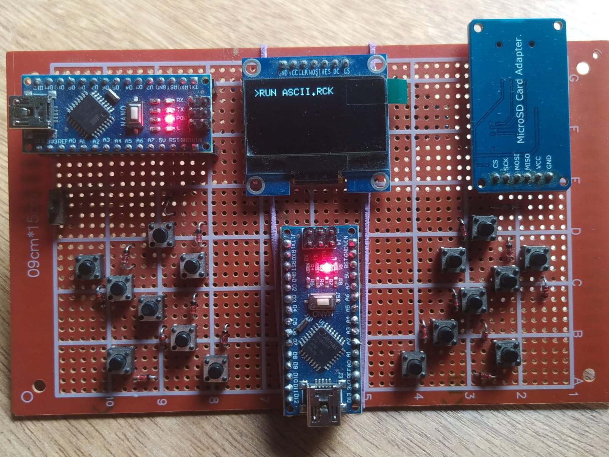
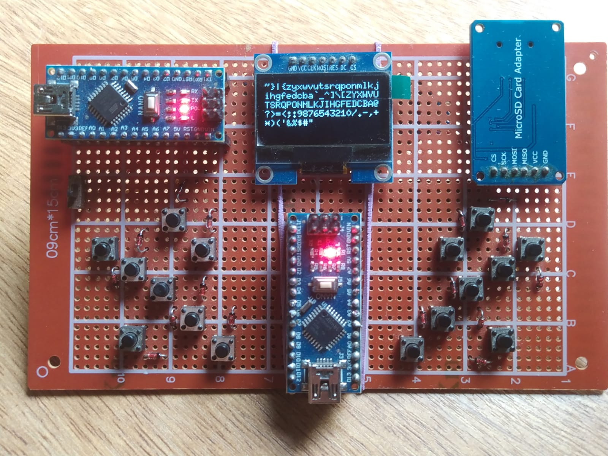

# CLOCK - Lenguaje de programación

# Indice

1. [Descripción del proyecto](#descripción-del-proyecto)
2. [Ventajas de utilizar CLOCK](#ventajas-de-utilizar-clock)
   - [Abstracción del microcontrolador al más bajo nivel](#abstracción-del-microcontrolador-al-más-bajo-nivel)
   - [Ampliación de los recursos del microcontrolador](#ampliación-de-los-recursos-del-micontrolador)
   - [WORA - Write Once Run Anywhere](#wora-write-once-run-anywhere)
   - [Aprovechamiento de los recursos al máximo](#aprovechamiento-de-los-recursos-al-máximo)
   - [Bajo coste](#bajo-coste)
3. [Limitaciones de CLOCK](#limitaciones-de-clock)
   - [Uso restringido de la memoria RAM](#uso-restringido-de-la-memoria-ram)
   - [Set de instrucciones reducido](#set-de-instrucciones-reducido)
   - [Curva de aprendizaje](#curva-de-aprendizaje)
   - [Velocidad](#velocidad)

## Descripción del proyecto

CLOCK es un lenguaje de programación similar a assembler orientado a microcontroladores.

Este surge como proyecto personal con el objetivo de crear una computadora/terminal que pueda ejecutar programas sobre microcontroladores con recursos limitados - como lo es arduino (ATMEGA328p) - y extender las capacidades del mismo de manera sencilla y con bajos costes, aprovechando así al máximo el poder de estos pequeños gigantes.

## Ventajas de utilizar CLOCK

El código en CLOCK se "compila" y se ejecuta directamente sobre una tarjeta SD ampliando la memoria del Arduino a el tamaño de la tarjeta SD a través de la interfaz SPI de un módulo SD. 

Con esto se logra pasar de 32KB (Flash) del Arduino a 2, 8, 16, o 32 GB (dependiendo de la tarjeta SD). Logrando asi separar el código de la plataforma y generando algo similar al bytecode de java, pudiendo correr el mismo código sobre cualquier otro microcontrolador siempre y cuando cuente con el interprete correspondiente (Algo similar a lo que ocurre con la JVM de java).

### Abstracción del microcontrolador al más "bajo nivel"

CLOCK es muy similar a assembler lo que permite operar el hardware con un set de instrucciones básico.

### Ampliación de los recursos del micontrolador 

**32KB (KiloBytes) -> 32GB (GigaBytes)**

Como el código en CLOCK es "compilado" y ejecutado sobre una tarjeta SD, el tamaño de almacenamiento aumenta significativamente lo que permite no solo almacenar más código, sino también ejecutar distintos programas sobre el mismo microcontrolador, sin tener que compilar sobre el IDE cada vez.

### WORA Write Once Run Anywhere 

**Código multiplataforma**

El código en CLOCK es "compilado" (traducido) mediante python a instrucciones de 4 bytes lo que permite mayor eficiencia de almacenamiento y mejor aprovechamiento de los recursos del microcontrolador. Esto supone la ventaja adicional que contando con el interprete correspondiente cargado sobre el microcontrolador el mismo programa podrá ser ejecutado sobre diversos microcontroladores sin necesidad de recompilar nuevamente para cada uno, logrando así código de bajo nivel multiplataforma.

### Aprovechamiento de los recursos al máximo

CLOCK utiliza dos 'bancos' de memoria acotados que se definen sobre el hardware existente por lo que los programas en CLOCK deberán ser planificados para explotar estos recursos al máximo.

### Bajo coste

Como el lenguaje está destinado a correr sobre microcontroladores el consumo energético de los mismos es extremadamente bajo, lo que permite al usuario contar con una plataforma programable portatil que se ejecute con baterias u otras fuentes de energia como paneles solares, logrando asi total independecia de la computadora. Además el coste de los módulos lectores de SD (si no vienen ya integrados en el microcontrolador) rondan los 3 USD por lo que esta ampliación no supondría un impacto económico significativo.

## Limitaciones de CLOCK

Si bien CLOCK es una buena promesa cuenta con algunas limitaciones que podrian llevar al usuario/a sobre un camino sinuoso tales como:

### Uso restringido de la memoria RAM: 

CLOCK amplia la memoria de almacenamiento del arduino, lo que se traduce en almacenar mayores cantidades de código dentro del mismo. Pero el lenguaje no amplía la RAM disponible e incluso se maneja dentro de un rango disponible, lo que limita las capacidades de los programas. Para solucionar este problema se deberá ser ingenioso con el uso de los 'Bancos' de memoria para lograr el resultado esperado,

### Set de instrucciones reducido

El set de instrucciones de CLOCK podria resultar reducido para usuarios/as experimentados en el uso de microcontroladores, ya que el lenguaje aún no cuenta con manejo de pines, ni instrucciones de 'alto nivel' por lo que escribir código en CLOCK podria resultar una tarea desafiante para usuarios no experimentados. Sin embargo esto se compensa en no estar limitado por la cantidad de código que se puede escribir ya que como se mencionó anteriormente se amplia el almacenamiento del microcontrolador.

### Curva de aprendizaje

Si bien CLOCK fue diseñado con la intención de ser simple, el mismo también se basa en el lenguaje ensamblador por lo que no estar familiarizado con la utilización de un lenguaje de mnemonicos (como assembler) podria presentar dificultades.

### Velocidad

Al ser código binario la interpretación del código en CLOCK es suficientemente rápida para tareas comunes, pero no se recomienda el uso de este lenguaje en sistemas de tiempo real críticos, ya que la misma consume algo de tiempo y puede afectar los sistemas donde el tiempo es un factor clave.

# Sobre el repositorio

Dentro del repositorio existen los siguientes proyectos:

- [ARDUINO_PS2_TERMINAL](./src/ARDUINO_PS2_TERMINAL/) 
- [ARDUINO_SERIAL_TERMINAL](./src/ARDUINO_SERIAL_TERMINAL/)
- [ARDUINO_STANDALONE_TERMINAL](./src/ARDUINO_STANDALONE_TERMINAL/)
- [DEVELOP_CLOCK_TERMINAL](./src/DEVELOP_CLOCK_TERMINAL/)
- [CLOCK_compiler](./src/CLOCK_compiler/)

Los mismos contienen el siguiente contenido:

| Proyecto - Documentación | Descripción |
|:-------------------:|:---------:|
| ARDUINO_PS2_TERMINAL | Basado en un único arduino uno es una terminal individual que ejecuta CLOCK ingresado desde un teclado PS2  |
| ARDUINO_SERIAL_TERMINAL | Perfecto para los que cuentan solo con un arduino y el módulo SD, es la configuración más pequeña para ejecutar CLOCK en microcontroladores |
| ARDUINO_STANDALONE_TERMINAL | Basado en dos Arduino NANO, ideal como terminal portátil de CLOCK |
| DEVELOP_CLOCK_TERMINAL | Terminal independiente que ejecuta CLOCK en Windows o Linux. Se implementó en C++ con el objetivo de poder ejecutar CLOCK en computadoras convencionales |
| CLOCK_compiler | Es el "compilador" de CLOCK, el mismo traduce los archivos .CLK a ejecutables .RCK por cualquiera de los proyectos anteriores (interpretes) |

